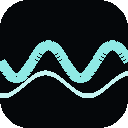
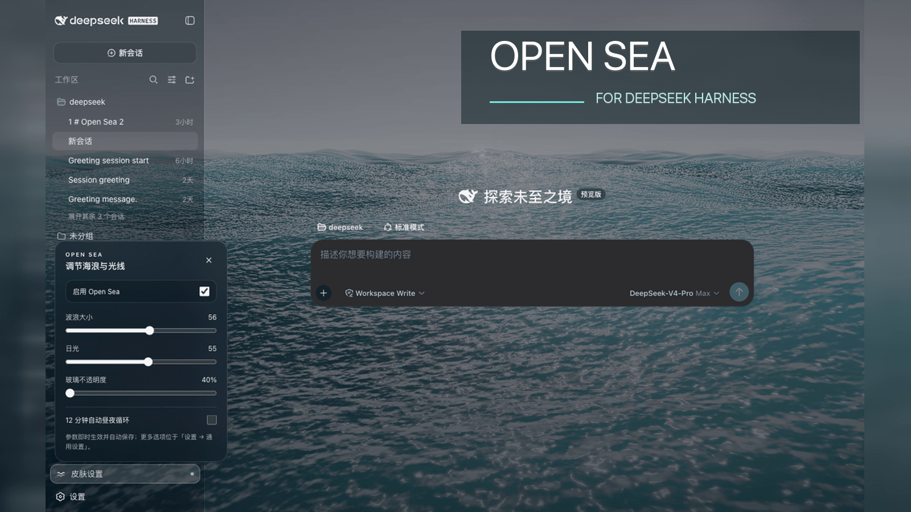
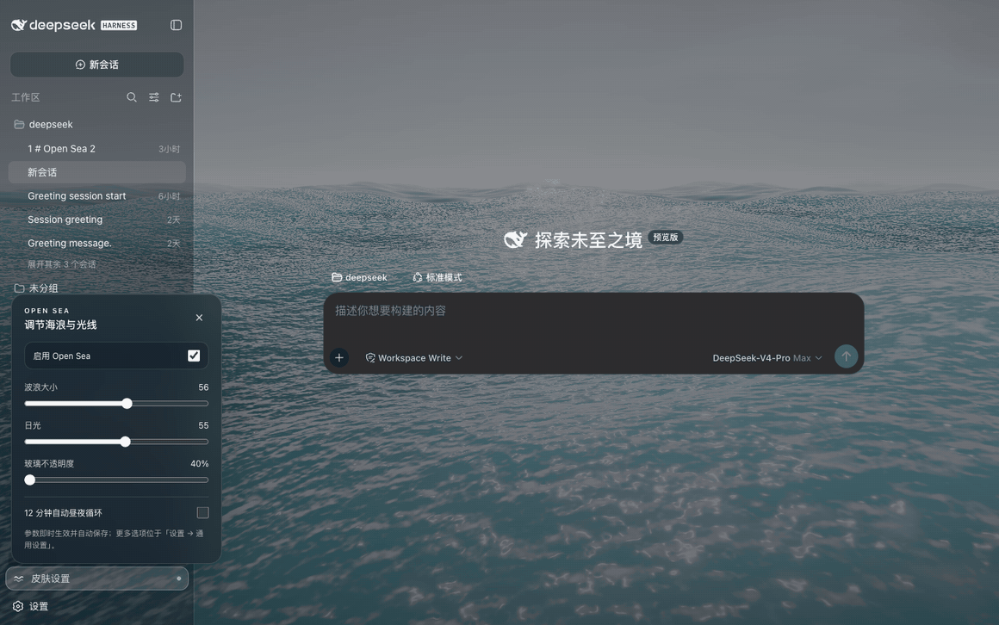
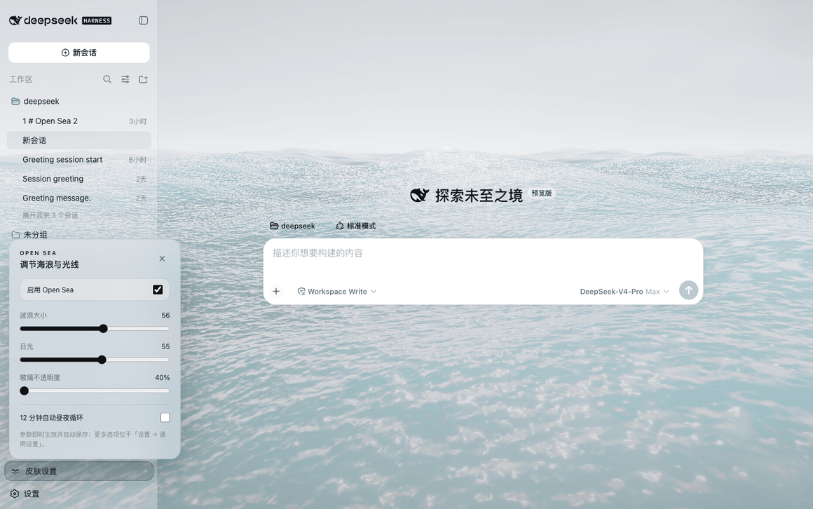
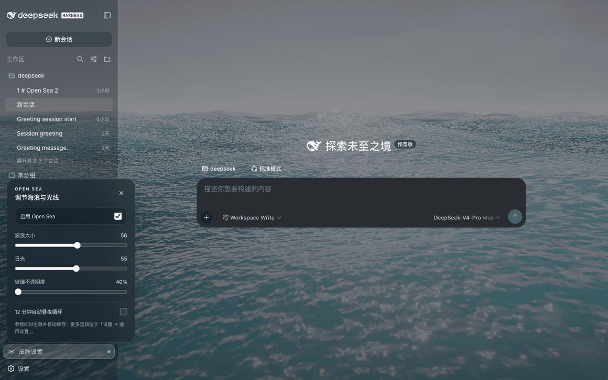
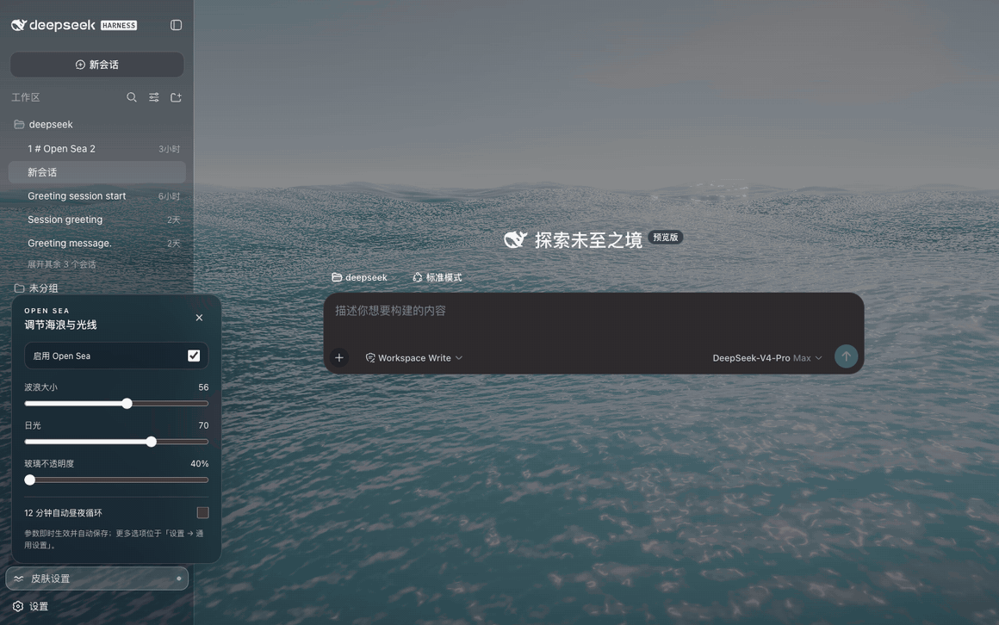

<div align="center">
  
  <h1>Open Sea Skin · DeepSeek Harness Ocean Theme</h1>
  <p><strong>A living ocean behind your workspace.</strong><br>实时海洋 · 夕阳光影 · 透明玻璃界面</p>
  <p><a href="README.zh.md">简体中文</a> · <strong>English</strong></p>
  <p>
    <a href="https://github.com/hanfei05121/dsh-theme-sea/releases"></a>
    <a href="https://www.npmjs.com/package/dsh-theme-sea"></a>
    <a href="https://github.com/hanfei05121/dsh-theme-sea/actions/workflows/ci.yml"></a>
    <a href="LICENSE"></a>
  </p>
  <h2>👀 Before installing, try the live website</h2>
  <p>Move the waves. Find your sunset. Tune the glass.<br><strong>Preview the skin yourself before choosing an installation method.</strong></p>
  <p><a href="https://hanfei05121.github.io/dsh-theme-sea/"><strong>🌊 Interactive demo</strong></a> · <a href="#install">📦 Install</a> · <a href="https://github.com/hanfei05121/dsh-theme-sea/releases">🚀 Releases</a> · <a href="https://github.com/hanfei05121/dsh-theme-sea/issues">💬 Get help</a></p>
</div>



**Open Sea Skin is an open-source ocean theme and appearance plugin for DeepSeek Harness (DSH).** It adds a real-time WebGPU animated background, adjustable waves, daylight-to-sunset lighting, and a translucent glass interface. Use it as a DSH plugin, a Harness-only Chrome/Edge extension, or a static frontend integration.

> Community-made, not an official DeepSeek product. A modified fork of [d-dev0101/open-sea-skin](https://github.com/d-dev0101/open-sea-skin) (MIT), customising the glass surfaces, float colours and composer chrome. This skin targets **DeepSeek Harness**, not the DeepSeek chat website. It is unrelated to the OpenSea NFT marketplace.

<p align="center"><a href="#features">Features</a> · <a href="#gallery">Gallery</a> · <a href="#install">Installation</a> · <a href="#faq">FAQ</a> · <a href="#development">Development</a></p>

<a id="features"></a>

## ✨ Your workspace, your sea

| Feature | What you can do |
| --- | --- |
| 🌊 Real-time ocean | Watch animated waves and reflections, rather than a looping wallpaper video. |
| 🌅 Daylight & sunset | Set your own light or enable the twelve-minute day/night cycle. |
| 🫧 Transparent interface | Adjust glass opacity from **40% to 90%** in light or dark Harness layouts. |
| 🎛️ Quick controls | Change sea state, sunlight and opacity from the lower-left skin settings panel. |
| 🏠 Your homepage stays yours | The extension does not replace new tabs or change your browser homepage. |
| 🔒 Local assets | Ocean scripts, three.js and fonts ship with the skin; no skin analytics or runtime CDN requests. |
| ⌨️ Thoughtful controls | Chinese/English UI, keyboard navigation, Escape to close, and reduced-motion support. |

<a id="gallery"></a>

## 🎬 Open Sea inside DeepSeek Harness

These recordings show the native Harness integration at **40% glass opacity**. Overview settings: wave size **56**, daylight **Afternoon (55)**. The [interactive website](https://hanfei05121.github.io/dsh-theme-sea/) lets you try the controls before installing.

### 🌙 Dark mode · an ocean behind your conversation



### ☀️ Light mode · a brighter workspace



### 🌊 Wave control · calm water to high sea

Daylight stays at Afternoon while wave size changes, then returns to 56.



### 🌅 Sunlight control · midday to sunset

Wave size stays at 56 while the light moves from Midday to Dusk.



<a id="install"></a>

## 📦 Choose your installation

**Choose one method.** Installing several at once makes updates and troubleshooting harder.

| Your setup | Best starting point |
| --- | --- |
| Harness Web / DSH plugin installer | [DSH plugin](#dsh-plugin) |
| Local Harness in Chrome or Edge | [Browser extension](#browser-extension) |
| Built frontend without plugin support | [Static installer](#static-installer) |
| Developing a Harness source integration | [Native integration guide](harness-plugin/README.md) |

<a id="dsh-plugin"></a>

### 1. DSH plugin

**Release status:** this fork ships as GitHub tag **v1.2.7**; the repository already carries the built assets, so nothing is compiled at install time. `dsh-theme-sea` is not published on npm yet.

Install straight from the GitHub tag:

```sh
dsh plugin --profile web add 'github:hanfei05121/dsh-theme-sea#v1.2.7'
```

Once it is on npm, this also works:

```sh
dsh plugin --profile web add dsh-theme-sea@1.2.7
```

Restart Harness, reload its page, then open **Skin settings** at the lower left. In DSH Desktop, use the managed plugin installer and restart from Desktop settings; available update versions depend on the catalog and installation source.

[Installation & troubleshooting →](docs/dsh-plugin.md)

<a id="browser-extension"></a>

### 2. Chrome / Edge extension

1. [Download the extension ZIP](https://github.com/hanfei05121/dsh-theme-sea/releases/download/v1.2.7/open-sea-skin-extension-v1.2.7.zip) and unzip it.
2. Open `chrome://extensions` or `edge://extensions`; enable **Developer mode**.
3. Choose **Load unpacked** and select the extracted folder containing `manifest.json`. If you cloned the repository, choose `extension/`.
4. Open your Harness page on `127.0.0.1` or `localhost` and reload it.

**No new-tab takeover.** The extension verifies the Harness page before injecting the ocean; other local development pages and existing homepage extensions remain untouched.

<a id="static-installer"></a>

### 3. Static frontend installer

For a built Harness frontend that cannot use the plugin. **Stop Harness first.** [Inspect the script](install.sh), then run from any directory:

```sh
curl -fsSL https://raw.githubusercontent.com/hanfei05121/dsh-theme-sea/main/install.sh | bash
```

Start `dsh web` again and keep it running. After a Harness frontend upgrade, rerun the command with `bash -s -- --update`. This method changes frontend files; it does not start the server.

[Explicit frontend paths, backups & recovery →](native-dist/README.md)

<a id="faq"></a>

## 💡 Before you install

<details>
<summary><strong>Does this change my new-tab page or the DeepSeek website?</strong></summary>

No. The extension targets a verified local DeepSeek Harness page. It does not replace your browser homepage or skin `chat.deepseek.com`.

</details>

<details>
<summary><strong>How do I disable or uninstall the skin?</strong></summary>

Turn off the skin in the quick-controls panel to keep it installed without the ocean. To remove a DSH plugin:

```sh
dsh plugin --profile web remove dsh-theme-sea
```

Restart Harness. Remove the browser extension through the browser's extensions page. For a static installation, stop Harness and run:

```sh
curl -fsSL https://raw.githubusercontent.com/hanfei05121/dsh-theme-sea/main/install.sh | bash -s -- --uninstall
```

Then restart Harness. The static installer removes its own marked loader/assets, not your sessions. See the [recovery guide](native-dist/README.md) if a page fails to load.

</details>

<details>
<summary><strong>Is every latest Harness/Desktop version tested?</strong></summary>

No blanket compatibility claim. Native source integration was verified against Harness `0.1.2-alpha.3`, commit `dd6322d60` (August 31, 2026). Desktop regression tests use a Chromium shell fixture based on DSH Desktop Beta `2.0.5-beta.1`, covering 24 layout/material/theme/opacity combinations—not a full native desktop end-to-end test.

If an update breaks the skin, [report your Harness version, installation method and a redacted screenshot/log](https://github.com/hanfei05121/dsh-theme-sea/issues).

</details>

<details>
<summary><strong>What about performance and privacy?</strong></summary>

The renderer uses adaptive resolution, hidden-tab pause and reduced-motion handling. Animated 3D rendering still uses GPU resources; try the demo on your device first.

The skin does not collect or transmit chat data. Extension permissions are limited to storage and the local Harness hosts. This statement describes Open Sea, not the host application's own behavior. [Privacy & permissions →](docs/privacy.md)

</details>

<a id="development"></a>

## 🛠️ Built for an open ecosystem

The renderer uses **WebGPU, three.js and TSL**, with five Gerstner waves, reflections, foam and sky lighting. The canonical runtime lives in `shared/`; generated plugin, extension and static-loader copies stay synchronized. `site/` preserves the original showcase.

With Node.js 20+:

```sh
npm ci
npm run build
npm run check
npx playwright install chromium
npm run test:browser
npm run test:desktop
npm run test:website
```

| Resource | Purpose |
| --- | --- |
| [Architecture](docs/architecture.md) | Renderer, shared controller and installation adapters |
| [Native source integration](harness-plugin/README.md) | Harness settings/slots integration and pinned compatibility |
| [Release guide](docs/releasing.md) | Packaging and publishing |
| [Changelog](CHANGELOG.md) | Fixes and version history |
| [Contributing through Issues / PRs](https://github.com/hanfei05121/dsh-theme-sea/issues) | Bug reports, ideas and improvements |
| [DSH plugin topic](https://github.com/topics/dsh-plugin) | Explore the wider community ecosystem |

## 🤝 Community & license

Made for people who want a more personal DeepSeek Harness workspace. Feedback, bug reports and contributions are welcome. Please never post passwords, tokens or private conversations in an Issue.

Project code is [MIT licensed](LICENSE). third-party code and fonts retain their own licenses; see [Third-party notices](THIRD_PARTY_NOTICES.md).

<p align="center"><a href="https://hanfei05121.github.io/dsh-theme-sea/"><strong>🌊 Find your sea — try the live demo</strong></a></p>
